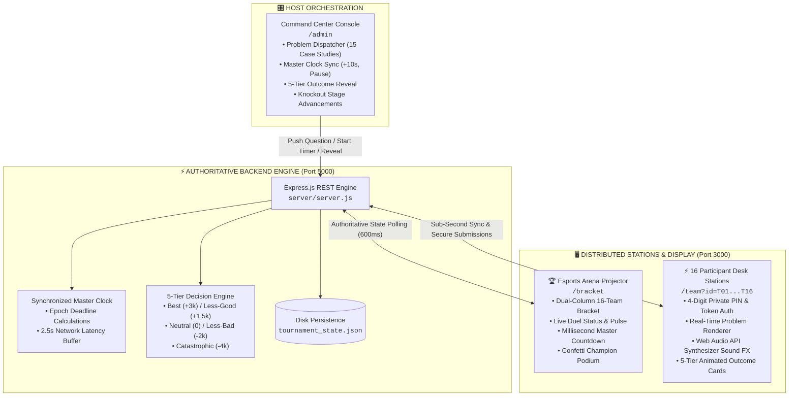

<div align="center">

# ⚡ CYBERNAUTS ARENA

### Real-Time 16-Team Simultaneous 1v1 Cybersecurity & Engineering Tournament Platform

[](https://nextjs.org/)
[](https://react.dev/)
[](https://expressjs.com/)
[](https://www.typescriptlang.org/)
[](https://www.framer.com/motion/)
[](https://developer.mozilla.org/en-US/docs/Web/API/Web_Audio_API)

<p align="center">
  <strong>An esports-grade competition engine designed for high-stakes collegiate and developer hackathon tournaments.</strong><br>
  Synchronizes 16 physical participant tables, an auditorium 4K arena projector, and an authoritative master clock with zero drift.
</p>

[System Architecture](#-system-architecture) •
[Key Engineering Highlights](#-key-engineering-highlights) •
[5-Tier Decision Matrix](#-5-tier-decision-matrix) •
[Portals & Interfaces](#-portals--interfaces) •
[Quickstart](#-quickstart--installation) •
[API Specification](#-rest-api-specification)

</div>

---

## 🎯 The Engineering Challenge

During live technical tournaments, traditional quiz tools and forms fail:
1. **Clock Drift**: Client timers drift across 16 different laptops and mobile devices over unpredictable venue Wi-Fi networks.
2. **Network Drops & Race Conditions**: Submitting answers with milliseconds left often results in dropped packets or false time-outs.
3. **Binary Scoring Inadequacy**: Real-world cybersecurity and site reliability incidents are not binary multiple-choice questions. In production outages, some actions are optimal, some are suboptimal, and some cause cascading infrastructure downtime.
4. **Spectator Disconnect**: Live audiences in auditoriums lack a unified, broadcast-grade esports projector showing who is dueling whom, real-time score swings, and countdown pressure.

**Cybernauts Arena** was engineered from the ground up to solve these exact constraints.

---

## 📐 System Architecture



---

## ⚡ Key Engineering Highlights

### 1. Sub-Second Master Clock Synchronization
- Rather than running independent countdown timers on client browsers, the backend generates an authoritative deadline timestamp:
  $$\text{deadline} = \text{Date.now()} + (\text{duration} \times 1000)$$
- Client stations compute remaining time dynamically relative to the server timestamp, completely eliminating clock skew.
- **2.5-Second Network Grace Buffer**: An extra 2,500ms tolerance window accounts for venue Wi-Fi latency spikes, ensuring valid submissions made before expiry are not discarded.
- **Dynamic Time Injection**: The tournament director can inject `+10s` or pause/resume mid-countdown; unfreezing automatically transitions the workflow phase from `locked/expired` back to `active`.

### 2. 5-Tier Game-Theoretic Credit Economy
Unlike naive MCQ systems (+4 / -1), Cybernauts Arena models realistic incident response scenarios where options carry variable consequence weights:

| Outcome Tier | Credit Delta | Strategic Impact |
| :--- | :---: | :--- |
| **🟢 Best Answer** | **+3,000 CR** | Optimal incident containment with minimum collateral damage |
| **🔵 Less-Good** | **+1,500 CR** | Effective but inefficient resolution (e.g., redundant overhead) |
| **⚪ Neutral** | **0 CR** | Harmless action that fails to resolve the underlying problem |
| **🟠 Less-Bad** | **-2,000 CR** | Suboptimal workaround causing minor service degradation |
| **🔴 Catastrophic** | **-4,000 CR** | Critical failure (e.g., clearing production cache, disabling firewalls) |

> **Tie-Breaker Rule**: In the event of equal credits after 3 case study questions, the system automatically resolves the victor using aggregate sub-second submission speed.

### 3. Native Web Audio API Sound Synthesizer
- Built **without external audio MP3/WAV assets** to guarantee instantaneous loading and zero audio lag across mobile and desktop devices.
- Uses native Web Audio oscillators:
  - **Ticking Clock**: Short 880Hz square-wave pulses for the final 10 seconds.
  - **Success Chime**: Harmonic two-tone ascending chord ($523.25\text{ Hz} \rightarrow 659.25\text{ Hz}$).
  - **Penalty Tone**: Low sawtooth dissonance ($130.81\text{ Hz}$) conveying credit loss.

### 4. 45 Real-World Engineering & Cyber Case Studies
The platform ships with 15 curated 3-part incident response duel sets (45 total questions), including:
- Wi-Fi Venue Outage Diagnostics & Subnet Isolation
- SQL Injection in Legacy ERPs & Parameterized Prepared Statements
- Distributed Lock Deadlocks in Redis Cluster
- Zero-Day API Key Leakage & Revocation Runbooks
- Memory Leaks in High-Throughput Node.js Services
- DDoS Mitigation & Cloudflare Rate Limiting Rules

---

## 🖥️ Portals & Interfaces

### 1. 🏆 Esports Arena Projector (`/bracket`)
- Designed for auditorium projectors and secondary broadcast screens.
- Dual-column knockout tree: Round of 16 (8 duels) $\rightarrow$ Quarterfinals (4 duels) $\rightarrow$ Semifinals (2 duels) $\rightarrow$ Grand Finals $\rightarrow$ Champion Podium.
- Live duel status badges (`ACTIVE`, `ANSWERED`, `EVALUATED`), animated gradient borders, and canvas confetti celebrations.

### 2. ⚡ Participant Desk Station (`/team?id=T01`)
- Table-optimized client with 4-digit PIN authentication.
- Real-time question broadcast with code snippet syntax styling.
- 5-tier dynamic outcome breakdown revealed only when tournament director initiates evaluation.
- Prevents multi-submission race conditions by locking strictly to the currently active question ID.

### 3. 🎛️ Tournament Command Center (`/admin`)
- Organizer cockpit protected by organizer passcode (`cybernauts2026`).
- Duel set selection, problem dispatcher, and master timer controls.
- Real-time submission status matrix (monitors which tables have answered, their elapsed seconds, and submission timestamps).
- Stage advance controls, team roster editor, and emergency score overrides.

---

## 🚀 Quickstart & Installation

### Prerequisites
- [Node.js](https://nodejs.org/) v18.0.0 or higher
- npm v9+ or bun

### 1. Clone & Install
```bash
# Clone the repository
git clone https://github.com/aumanshkaushal/cybernauts-arena.git
cd cybernauts-arena

# Install root frontend dependencies
npm install

# Install backend dependencies
cd server && npm install && cd ..
```

### 2. Run the Platform
Run both the Express backend (`:5000`) and Next.js frontend (`:3000`) with a single command:
```bash
npm run dev
```

### 3. Access Portals
| Portal | URL | Credentials / Notes |
| :--- | :--- | :--- |
| **Landing Hub** | `http://localhost:3000/` | Navigation dashboard & system telemetry |
| **Arena Projector** | `http://localhost:3000/bracket` | Fullscreen stadium display |
| **Team Desks** | `http://localhost:3000/team?id=T01` | Teams `T01` through `T16` (Default PIN: See below) |
| **Command Center** | `http://localhost:3000/admin` | Default Passcode: `cybernauts2026` |

---

## 🔑 Default Team Table Credentials

| Team ID | Seed | Default Team Name | 4-Digit PIN | Access Token |
| :---: | :---: | :--- | :---: | :---: |
| `T01` | 1 | DEBUGGERS | `4821` | `tok_t01_b83f` |
| `T02` | 16 | TRIBYTES | `7392` | `tok_t02_c91a` |
| `T03` | 2 | HACK3RS | `5164` | `tok_t03_d48b` |
| `T04` | 15 | 404 | `9273` | `tok_t04_e20c` |
| `T05` | 3 | OLIPHANS | `3841` | `tok_t05_f73d` |
| `T06` | 14 | STACK OVERLOADS | `6529` | `tok_t06_g15e` |
| `T07` | 4 | CODEHUB | `1947` | `tok_t07_h62f` |
| `T08` | 13 | ERROR 404 | `8362` | `tok_t08_j94a` |
| `T09` | 5 | TEAM DIAMOND | `2758` | `tok_t09_k37b` |
| `T10` | 12 | CODEFLIX | `4193` | `tok_t10_l88c` |
| `T11` | 6 | XSCAVENGERS | `7631` | `tok_t11_m42d` |
| `T12` | 11 | PACKET PREDATORS | `5824` | `tok_t12_n91e` |
| `T13` | 7 | NULLCORE | `9416` | `tok_t13_p55f` |
| `T14` | 10 | BINARY BRAIN | `3285` | `tok_t14_q76a` |
| `T15` | 8 | VOID CODE | `6749` | `tok_t15_r23b` |
| `T16` | 9 | BUG HUNTERS | `1538` | `tok_t16_s89c` |

*(All names, pins, and seeds can be customized dynamically in the Admin Console).*

---

## 📡 REST API Specification

| Endpoint | Method | Description |
| :--- | :---: | :--- |
| `/api/tournament/state` | `GET` | Authoritative tournament state (bracket, active duels, master clock) |
| `/api/tournament/team/:teamId` | `GET` | Sanitized team view for participant desk |
| `/api/tournament/auth-team` | `POST` | Authenticate desk station using team PIN or token |
| `/api/tournament/push-question` | `POST` | Dispatch active case study problem statement to all tables |
| `/api/tournament/start-timer` | `POST` | Initialize synchronized master countdown |
| `/api/tournament/push-and-start` | `POST` | Atomically dispatch problem and trigger timer |
| `/api/tournament/timer-action` | `POST` | Execute `pause`, `resume`, `add-time` (+10s), or `stop` |
| `/api/tournament/submit-answer` | `POST` | Secure participant submission with latency compensation |
| `/api/tournament/reveal-outcomes` | `POST` | Evaluate round answers and compute 5-tier credit delta |
| `/api/tournament/advance-stage` | `POST` | Progress to next stage (Ro16 $\rightarrow$ QF $\rightarrow$ SF $\rightarrow$ Finals) |
| `/api/tournament/move-to-round-2` | `POST` | Explicitly transition to Quarterfinals and sync all accumulated points |
| `/api/tournament/move-to-semifinals` | `POST` | Explicitly transition to Semifinals (top 4 remaining) and sync points |
| `/api/tournament/set-duel-winner` | `POST` | Manual host override to declare duel winner |
| `/api/tournament/update-team` | `POST` | Rename team or edit members/color |
| `/api/tournament/reset` | `POST` | Reset bracket and seed new tournament state |

---

## 🛠️ Project Structure

```
cybernauts-arena/
├── README.md                      # Complete system documentation & API spec
├── .gitignore                     # Git ignore rules for Next.js & Node
├── package.json                   # Root orchestrator with concurrent runners
├── next.config.ts                 # Next.js config with reverse proxy rewrites
├── tsconfig.json                  # TypeScript compiler settings
├── src/
│   ├── app/
│   │   ├── layout.tsx             # Root layout with JetBrains Mono & Plus Jakarta fonts
│   │   ├── globals.css            # Dark cyberpunk theme & glowing pulse animations
│   │   ├── page.tsx               # Cyberpunk Landing Hub with live telemetry
│   │   ├── bracket/
│   │   │   └── page.tsx           # 16-Team Esports Arena Projector
│   │   ├── team/
│   │   │   └── page.tsx           # Participant Desk Station with Web Audio FX
│   │   └── admin/
│   │       └── page.tsx           # Tournament Command Center & Orchestration Console
└── server/
    ├── package.json               # Backend dependencies (express, cors)
    ├── server.js                  # Dedicated Express tournament API server
    ├── tournamentService.js       # Authoritative engine with 5-tier evaluation & clock sync
    └── tournamentQuestions.js     # 45 Incident response cybersecurity problems
```

---

## 📄 License

This project is licensed under the [MIT License](LICENSE). Built for high-stakes technology duels and esports-grade competitive programming.
